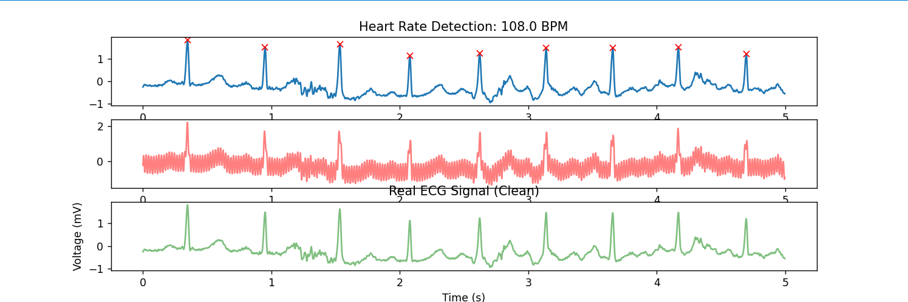

# ECG-Signal-Processing-Python
# ECG Signal Processing & Peak Detection
A Python-based project to filter 50Hz electrical noise from a real ECG signal using Fast Fourier Transform (FFT) and detect Heart Rate (BPM).

## 🚀 Features:
- Real-world ECG data from SciPy datasets.
- 50Hz Noise removal using FFT frequency filtering.
- Automatic Heart Rate (BPM) detection using SciPy `find_peaks`.

## 📊 Visual Results:

